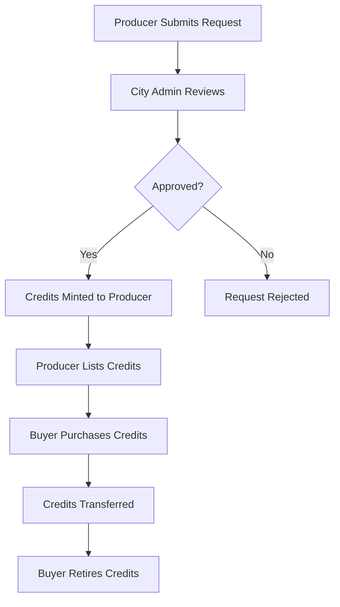

# HydroCred - Green Hydrogen Credit System

<div align="center">
  
  
  **Blockchain-based Green Hydrogen Credit Tracking & Trading Platform**
  
  [](https://opensource.org/licenses/MIT)
  [](https://nodejs.org/)
  [](https://reactjs.org/)
  [](https://ethereum.org/)
  [](https://mongodb.com/)
</div>

## 🌍 Project Overview

HydroCred is a comprehensive blockchain-based system for tracking, certifying, and trading green hydrogen credits (H2 tokens). Each **H2 token represents 1 kg of certified green hydrogen production**, ensuring transparency and preventing fraud in the green energy ecosystem.

### 🎯 Key Features

- **🔐 Wallet-based Authentication** - MetaMask integration with signature-based login
- **👥 Hierarchical Role System** - Main Admin → Country Admin → State Admin → City Admin → Producers/Buyers
- **📋 Production Certification** - Multi-step certification process with document upload
- **🏪 Marketplace Trading** - Secure peer-to-peer credit trading with fraud prevention
- **🔍 Advanced Security** - Role-based access control, anti-fraud measures, audit trails
- **📊 Real-time Analytics** - Comprehensive dashboards with jurisdiction-based filtering
- **🌱 ERC-721 H2 Tokens** - Each token = 1kg certified green hydrogen
- **🗄️ MongoDB Integration** - Scalable database for user management and audit logs

## 🏗️ System Architecture

```
┌─────────────────┐    ┌─────────────────┐    ┌─────────────────┐
│   Frontend      │    │    Backend      │    │   Blockchain    │
│   (React)       │◄──►│  (Node.js)      │◄──►│   (Hardhat)     │
│                 │    │                 │    │                 │
│ • Role Dashboards│    │ • API Routes    │    │ • Smart Contract│
│ • Wallet Connect │    │ • User Mgmt     │    │ • Event Logs    │
│ • Marketplace UI │    │ • Production    │    │ • Access Control│
│ • Analytics     │    │ • Marketplace   │    │ • Token Mgmt    │
└─────────────────┘    └─────────────────┘    └─────────────────┘
                              │
                              ▼
                    ┌─────────────────┐
                    │    Database     │
                    │   (File-based)  │
                    │                 │
                    │ • User Profiles │
                    │ • Requests      │
                    │ • Marketplace   │
                    │ • Audit Logs    │
                    └─────────────────┘
```

## 👥 User Roles & Hierarchy

### **Country Admin** 🏛️
- Oversees states within their country
- Can appoint State Admins
- Full system oversight and analytics

### **State Admin** 🏢
- Oversees cities within their state  
- Can appoint City Admins
- Regional analytics and management

### **City Admin (Certifier)** ✅
- Certifies hydrogen production requests
- Issues credits to verified producers
- Local production oversight

### **Producers** 🏭
- Submit hydrogen production data for certification
- Receive H2 credits upon approval
- Can transfer/sell credits in marketplace

### **Buyers (Industry)** 🏢
- Purchase credits from marketplace
- Retire credits for compliance/offset
- Track carbon reduction impact

### **Auditors/Regulators** 📊
- View-only access to all transactions
- Export audit data (JSON/CSV)
- Monitor system integrity

## 🔄 Workflow



### Detailed Process:

1. **🏭 Production Request**: Producer submits hydrogen production data + documentation
2. **✅ Certification**: City Admin verifies and approves production 
3. **🪙 Minting**: Smart contract mints H2 tokens to producer's wallet
4. **🏪 Marketplace**: Producer lists credits for sale with pricing
5. **💰 Purchase**: Buyer purchases credits through marketplace
6. **🗑️ Retirement**: Buyer retires credits for compliance (permanent)

## 🚀 Quick Start

### Prerequisites

- **Node.js** 18+ 
- **npm** or **yarn**
- **MetaMask** browser extension
- **Git**

### 1. Clone Repository

```bash
git clone https://github.com/your-repo/hydrocred.git
cd hydrocred
```

### 2. Environment Setup

Create `.env` file in the root directory:

```env
# Server Configuration
PORT=5055
NODE_ENV=development

# Blockchain Configuration
RPC_URL=https://ethereum-sepolia.publicnode.com
CONTRACT_ADDRESS=0xaA7b945a4Cd4381DcF5D4Bc6e0E5cc76e6A3Fc39
PRIVATE_KEY=0x59c6995e998f97a5a0044966f0945389dc9e86dae88c7a8412f4603b6b78690d

# Security
AES_KEY=hydrocred_encryption_key_32_chars_minimum_length_required

# Demo Wallet Private Keys (for testing only)
ADMIN_PRIVATE_KEY=0x59c6995e998f97a5a0044966f0945389dc9e86dae88c7a8412f4603b6b78690d
PRODUCER_PRIVATE_KEY=0x5de4111afa1a4b94908f83103eb1f1706367c2e68ca870fc3fb9a804cdab365a
BUYER_PRIVATE_KEY=0x7c852118294e51e653712a81e05800f419141751be58f605c371e15141b007a6
```

Create `frontend/.env`:

```env
# Frontend Environment Configuration
VITE_BACKEND_URL=http://localhost:5055
VITE_CONTRACT_ADDRESS=0xaA7b945a4Cd4381DcF5D4Bc6e0E5cc76e6A3Fc39
VITE_RPC_URL=https://ethereum-sepolia.publicnode.com
VITE_CHAIN_ID=11155111
```

### 3. Install Dependencies

```bash
# Install all dependencies
npm install

# Backend dependencies
cd backend && npm install && cd ..

# Frontend dependencies  
cd frontend && npm install && cd ..

# Blockchain dependencies
cd blockchain && npm install && cd ..
```

### 4. Compile Smart Contracts

```bash
cd blockchain
npx hardhat compile
node scripts/copy-abi.js
cd ..
```

### 5. Start Services

**Terminal 1 - Backend Server:**
```bash
cd backend
npm run dev
```

**Terminal 2 - Frontend Application:**
```bash
cd frontend
npm run dev
```

**Terminal 3 - Local Blockchain (Optional):**
```bash
cd blockchain
npx hardhat node
```

### 6. Access Application

- **Frontend**: http://localhost:5173
- **Backend API**: http://localhost:5055
- **API Health**: http://localhost:5055/api/health

## 🧪 Demo Wallets & Testing

### Pre-configured Test Wallets

Import these private keys into MetaMask for testing:

| Role | Address | Private Key |
|------|---------|-------------|
| **Admin/Certifier** | `0x70997970C51812dc3A010C7d01b50e0d17dc79C8` | `0x59c6995e998f97a5a0044966f0945389dc9e86dae88c7a8412f4603b6b78690d` |
| **Producer** | `0x3C44CdDdB6a900fa2b585dd299e03d12FA4293BC` | `0x5de4111afa1a4b94908f83103eb1f1706367c2e68ca870fc3fb9a804cdab365a` |
| **Buyer** | `0x90F79bf6EB2c4f870365E785982E1f101E93b906` | `0x7c852118294e51e653712a81e05800f419141751be58f605c371e15141b007a6` |

⚠️ **Never use these keys on mainnet - for testing only!**

### Testing Workflow

1. **Connect Admin Wallet** → Register as Certifier
2. **Connect Producer Wallet** → Register as Producer → Submit production request
3. **Switch to Admin Wallet** → Approve production request (issues credits)
4. **Switch to Producer Wallet** → List credits on marketplace
5. **Connect Buyer Wallet** → Register as Buyer → Purchase credits
6. **Retire Credits** → Complete the carbon offset process

## 📱 User Interface Guide

### 🏠 Home Page
- Role selection and navigation
- System overview and statistics
- Getting started guide

### 🏭 Producer Dashboard
- **My Credits**: View owned credits and transfer functionality
- **Request Certification**: Submit new production requests
- **Sell Credits**: Create marketplace listings
- **Request History**: Track certification status

### ✅ Certifier Dashboard
- **Pending Requests**: Review and approve production requests
- **Issue Credits**: Direct credit issuance (admin only)
- **Issuance History**: Track all approved requests

### 🛒 Buyer Dashboard
- **Marketplace**: Browse and purchase available credits
- **My Credits**: Manage owned credits and retirement

### 📊 Regulator Dashboard
- **Blockchain Events**: Real-time transaction monitoring
- **System Analytics**: Comprehensive system statistics
- **Audit Trail**: Complete transaction history

## 🔧 API Documentation

### Core Endpoints

| Method | Endpoint | Description |
|--------|----------|-------------|
| `GET` | `/api/health` | System health check |
| `POST` | `/api/users/register` | User registration |
| `GET` | `/api/users/:address` | Get user profile |
| `POST` | `/api/production/request` | Submit production request |
| `GET` | `/api/production/requests` | Get production requests |
| `POST` | `/api/production/approve/:id` | Approve production request |
| `GET` | `/api/marketplace/listings` | Get marketplace listings |
| `POST` | `/api/marketplace/listing` | Create marketplace listing |
| `POST` | `/api/marketplace/purchase/:id` | Purchase credits |
| `GET` | `/api/ledger` | Get blockchain events |
| `GET` | `/api/analytics/overview` | System analytics |
| `GET` | `/api/audit/export` | Export audit data |

### Example API Usage

```javascript
// Register a new user
const response = await fetch('http://localhost:5055/api/users/register', {
  method: 'POST',
  headers: { 'Content-Type': 'application/json' },
  body: JSON.stringify({
    walletAddress: '0x...',
    role: 'producer',
    name: 'Green Energy Corp',
    organization: 'Green Energy Solutions',
    location: { country: 'USA', state: 'California', city: 'San Francisco' }
  })
});

// Submit production request
const productionRequest = await fetch('http://localhost:5055/api/production/request', {
  method: 'POST',
  headers: { 'Content-Type': 'application/json' },
  body: JSON.stringify({
    producerWallet: '0x...',
    producerName: 'Green Energy Corp',
    organization: 'Green Energy Solutions',
    location: { country: 'USA', state: 'California', city: 'San Francisco' },
    productionData: {
      hydrogenAmount: 100,
      productionDate: '2024-01-15',
      energySource: 'solar',
      energySourceDetails: 'Rooftop solar panels with 95% efficiency',
      carbonFootprint: 0.5,
      certificationDocuments: []
    }
  })
});
```

## 🔐 Security Features

### Fraud Prevention
- **Double Certification Prevention**: Database + blockchain hash verification
- **Role-based Access Control**: Smart contract enforced permissions
- **Admin Verification**: Certifiers require admin approval
- **Audit Trail**: Immutable blockchain transaction history

### Security Measures
- **Wallet-based Authentication**: No passwords, only cryptographic signatures
- **Input Validation**: Comprehensive data validation on frontend and backend
- **Rate Limiting**: API endpoint protection
- **Secure File Upload**: Document verification and storage

## 🛠️ Development

### Project Structure

```
hydrocred/
├── frontend/          # React TypeScript application
│   ├── src/
│   │   ├── components/    # Reusable UI components
│   │   ├── pages/         # Route components
│   │   ├── lib/           # Utilities and API clients
│   │   ├── contexts/      # React contexts
│   │   └── abi/           # Smart contract ABIs
├── backend/           # Node.js Express API
│   ├── src/
│   │   ├── routes/        # API route handlers
│   │   ├── lib/           # Business logic modules
│   │   ├── config/        # Configuration management
│   │   └── abi/           # Smart contract ABIs
├── blockchain/        # Hardhat smart contracts
│   ├── contracts/         # Solidity contracts
│   ├── scripts/           # Deployment scripts
│   └── test/              # Contract tests
└── docs/              # Documentation
```

### Available Scripts

**Root Level:**
```bash
npm install          # Install all dependencies
npm run setup        # Complete project setup
npm run start        # Start all services
npm run test         # Run all tests
```

**Frontend:**
```bash
npm run dev          # Start development server (port 5173)
npm run build        # Build for production
npm run preview      # Preview production build
npm run lint         # Run ESLint
```

**Backend:**
```bash
npm run dev          # Start development server (port 5055)
npm run build        # Compile TypeScript
npm run start        # Start production server
```

**Blockchain:**
```bash
npm run compile      # Compile smart contracts
npm run test         # Run contract tests
npm run deploy       # Deploy to Sepolia testnet
npm run deploy:local # Deploy to local network
```

## 🧪 Testing Guide

### Manual Testing Steps

1. **Setup Environment**
   ```bash
   # Start all services
   npm run start
   ```

2. **Test User Registration**
   - Connect MetaMask with demo wallet
   - Complete registration form
   - Verify user profile creation

3. **Test Production Flow**
   - Login as Producer
   - Submit production certification request
   - Switch to Certifier wallet
   - Approve request and issue credits

4. **Test Marketplace**
   - Create marketplace listing as Producer
   - Purchase credits as Buyer
   - Verify credit transfer

5. **Test Retirement**
   - Retire credits for compliance
   - Verify retirement on blockchain

### Automated Testing

```bash
# Run backend tests
cd backend && npm test

# Run frontend tests  
cd frontend && npm test

# Run smart contract tests
cd blockchain && npm test
```

## 🌐 Network Configuration

### Supported Networks

| Network | Chain ID | RPC URL |
|---------|----------|---------|
| **Sepolia Testnet** | 11155111 | `https://ethereum-sepolia.publicnode.com` |
| **Local Hardhat** | 31337 | `http://127.0.0.1:8545` |
| **Polygon Amoy** | 80002 | `https://rpc-amoy.polygon.technology` |

### MetaMask Setup

1. **Add Sepolia Testnet:**
   - Network Name: `Sepolia Test Network`
   - RPC URL: `https://ethereum-sepolia.publicnode.com`
   - Chain ID: `11155111`
   - Currency Symbol: `ETH`
   - Block Explorer: `https://sepolia.etherscan.io`

2. **Get Test ETH:**
   - Visit [Sepolia Faucet](https://sepoliafaucet.com/)
   - Enter your wallet address
   - Receive test ETH for transactions

## 📊 Analytics & Monitoring

### System Metrics
- **Total Users**: Registered users by role
- **Production Volume**: Certified hydrogen production
- **Credit Circulation**: Active vs retired credits
- **Marketplace Activity**: Trading volume and transactions

### Audit Features
- **Transaction Export**: JSON/CSV format
- **Blockchain Verification**: Cross-reference with explorer
- **User Activity Logs**: Registration and role changes
- **Production Audit Trail**: Request to credit issuance

## 🔧 Troubleshooting

### Common Issues

**1. "Module not found" errors**
```bash
# Clear node modules and reinstall
rm -rf node_modules package-lock.json
npm install
```

**2. "Contract not deployed" errors**
```bash
# Redeploy smart contracts
cd blockchain
npx hardhat compile
npx hardhat run scripts/deploy.ts --network sepolia
```

**3. "RPC connection failed" errors**
- Check internet connection
- Verify RPC URL in `.env` file
- Try alternative RPC endpoints

**4. MetaMask connection issues**
- Refresh browser page
- Disconnect and reconnect wallet
- Check network configuration

### Debug Mode

Enable debug logging:
```bash
export DEBUG=hydrocred:*
npm run dev
```

## 🤝 Contributing

### Development Setup

1. **Fork the repository**
2. **Create feature branch**: `git checkout -b feature/amazing-feature`
3. **Install dependencies**: `npm install`
4. **Make changes and test**
5. **Commit changes**: `git commit -m 'Add amazing feature'`
6. **Push to branch**: `git push origin feature/amazing-feature`
7. **Open Pull Request**

### Code Standards

- **TypeScript**: Strict type checking enabled
- **ESLint**: Airbnb configuration
- **Prettier**: Code formatting
- **Conventional Commits**: Commit message format

### Testing Requirements

- Unit tests for all business logic
- Integration tests for API endpoints
- E2E tests for critical user flows
- Smart contract test coverage > 90%

## 📄 License

This project is licensed under the MIT License - see the [LICENSE](LICENSE) file for details.

## 🙏 Acknowledgments

- **OpenZeppelin** - Smart contract security standards
- **Hardhat** - Ethereum development environment  
- **React** - Frontend framework
- **Tailwind CSS** - Styling framework
- **Framer Motion** - Animation library

## 📞 Support

- **Documentation**: [docs/](docs/)
- **Issues**: [GitHub Issues](https://github.com/your-repo/hydrocred/issues)
- **Discussions**: [GitHub Discussions](https://github.com/your-repo/hydrocred/discussions)

---

<div align="center">
  <p><strong>Building a sustainable future with transparent green hydrogen credits</strong></p>
  <p>Made with ❤️ for the environment</p>
</div>